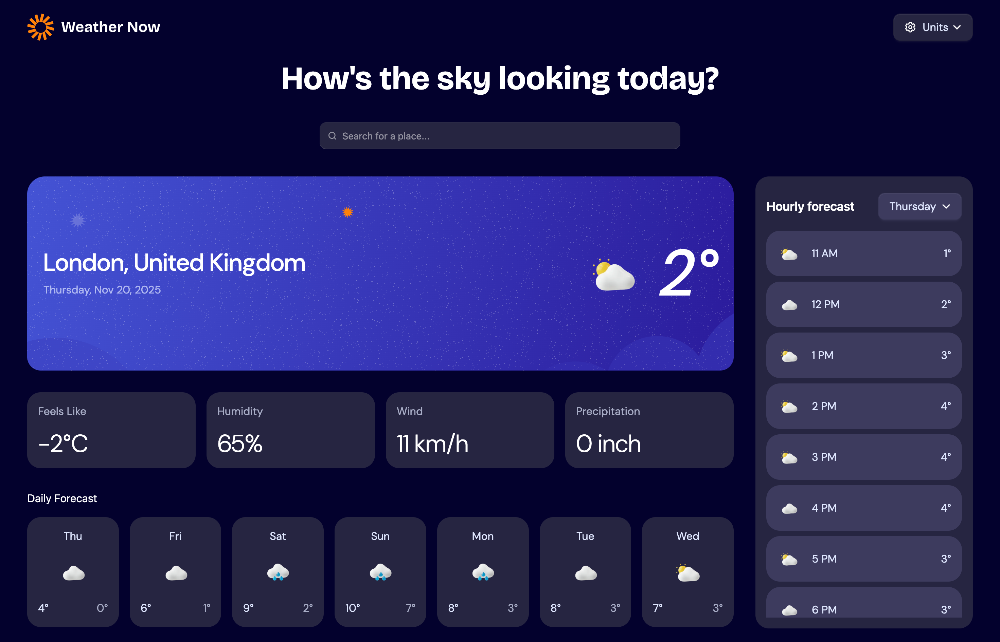
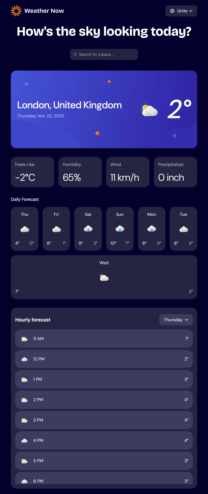
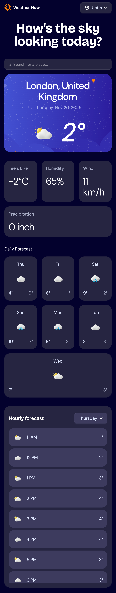

### `README_RU.md` (RU)

# Weathr — Weather Dashboard

**Weathr** is a modern weather dashboard built with React, TypeScript and Vite. The goal of this pet project is to practise feature-sliced architecture, global state management and UI design by implementing a small but realistic weather app. The page shows current conditions, hourly and daily forecasts, lets the user configure measurement units and ships with a custom dark theme. This repository exists for educational purposes and is not affiliated with any real-world weather provider.

Link to [Github pages](https://sunsetteq.github.io/weathr-vite/)

## Table of contents
- [Overview](#overview)
- [Features](#features)
- [Screenshots](#screenshots)
- [Tech stack](#tech-stack)
- [Getting started](#getting-started)
- [Project structure](#project-structure)

## Overview
The application consists of a single main page composed from multiple widgets following a feature-sliced approach. The layout includes a “today” card with current conditions, a compact daily forecast, an hourly timeline and a settings area for choosing measurement units.

Global state and user preferences (temperature scale, wind speed units, precipitation units, etc.) are stored in **Redux Toolkit**. Business logic is extracted into slices, while UI components are reused across widgets. Styling is handled by **Tailwind CSS v4** together with **daisyUI** and a custom dark theme based on OKLCH.

Module resolution uses custom aliases configured in `vite.config.ts` to keep imports clean, for example `@app` for the root application layer and `@ui` for reusable UI primitives. Weather and geocoding calls are wrapped in the `shared/api` layer so that the UI stays decoupled from concrete endpoints.

## Features
- **Location search & forecast loading** — the user can select a location and see its current weather, a short multi-day forecast and hourly values.
- **Configurable measurement units** — toggles for:
  - temperature (e.g. °C/°F),
  - wind speed,
  - precipitation units.  
  All preferences are stored in Redux and applied consistently across all widgets.
- **Responsive UI with dark theme** — layouts adapt across mobile, tablet and desktop breakpoints; the app uses a custom dark theme built on top of Tailwind CSS + daisyUI.
- **Type-safe architecture** — the entire codebase is written in TypeScript, with aliases and layered structure (app/pages/widgets/features/entities/shared) to keep refactoring safe and predictable.

## Screenshots

| Desktop | Tablet | Mobile |
|---|---|--- |
|  | |  |

## Tech stack
The project leverages modern front‑end tools and libraries:

| Tool | Purpose |
|---|---|
| **React 19** | Component library for building the user interface |
| **TypeScript** | Static typing for safer and more predictable development |
| **Vite** | Lightning-fast bundler and dev server |
| **Tailwind CSS v4** | Utility-first CSS framework for rapid styling |
| **daisyUI** | Component library on top of Tailwind with a custom dark theme |
| **Redux Toolkit & React-Redux** | Global state management and app-wide settings |
| **moment** | Date/time utilities for rendering forecasts |
| **ESLint & Prettier** | Code linting and formatting |
| **vite-plugin-svgr** | Enables importing SVG files as React components |

Aliases defined in the Vite config allow neat, relative‑free imports, such as @app → src/app, @pages → src/pages, @widgets → src/widgets and more 

## Getting started

```bash
git clone https://github.com/SunsetTeq/weathr-vite.git
cd weathr-vite

# install dependencies
yarn install
# or
npm install

# start dev server
yarn dev
# or
npm run dev
```


## Project structure
The project follows a feature‑sliced architecture.  Major folders and their purpose include:
| Directory | Description |
|---|---|
| **src/app** | Sets up global providers such as styles and defines the root component |
| **src/pages** | Top‑level routes; currently contains MainPage which composes all sections |
| **src/widgets** | Larger UI blocks (navigation bar, hero section, benefit cards, specification table, etc.) |
| **src/shared** | Shared resources: assets, configuration, hooks, UI primitives and utility functions |
| **src/shared/config/constants** | Contains arrays and objects that hold content for the page |
| **src/shared/assets** | Images and icons used throughout the site, including screenshot assets for the README |

The Vite alias configuration maps these folders to short prefixes, making imports cleaner
